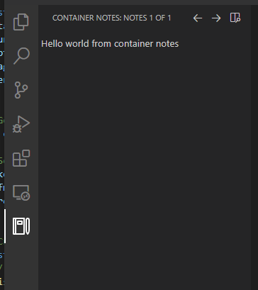

# ContainerNotes

This is a modified version of [sidebar-markdown-notes](https://github.com/AssisrMatheus/sidebar-markdown-notes).

I want to take notes at the sidebar and have a dedicated container of it.

I am not familir with js and ts, so I do some change to `sidebar-markdown-notes` in order to meet my needs.

Base codes come from unpacked extension release instead of original repo because of my poor ts/js skill.

## Install

~download container-notes.vsix and install it using vscode.~

cannot provide a valid vsix file yet, have to download whole folder to vscode extensions folder

## Screenshot

------

Container icon: https://www.svgrepo.com/svg/294574/notebook-agenda

